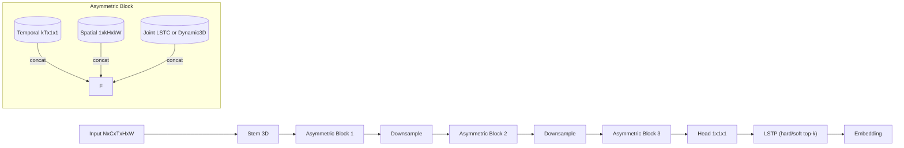

## LSTC/LSTP for Gait Recognition

LSTC/LSTP is a lean, reproduction-friendly spatio-temporal pipeline for gait. It uses a height-stripe prior with efficient 3D depthwise convs and offers asymmetric branches, hard/soft temporal selection, and an optional dynamic 3D joint branch.

- Local Spatio-Temporal Convolution (LSTC): depthwise 3D within height stripes + 1×1×1 mix; prevents cross-stripe leakage.
- Asymmetric block: temporal-only, spatial-only, and joint branches; fuse with 1×1×1.
- Local Spatio-Temporal Pooling (LSTP): stripe-wise top-k over time (hard) or temperature-weighted soft selection.
- Dynamic joint option: an expert-gated 3D convolution as an alternative to LSTC in the joint branch.

For Chinese documentation, see: [README_zh.md](README_zh.md)

### Architecture at a glance



### What's inside
- `lstc/modules.py`: LSTC, asymmetric block, LSTP
- `lstc/model.py`: reference backbone `LSTCBackbone`
- `lstc/losses.py`, `lstc/samplers.py`, `lstc/utils.py`
- Examples: `examples/` (toy/real/metric/multiview/train | eval | extract)
- Configs: `configs/real.yaml`, `configs/metric.yaml`, `configs/multiview_real.yaml`, `configs/multiview_metric.yaml`, `configs/casia_b.yaml`, `configs/ou_mvlp.yaml`

### Install (GPU with uv recommended)
1) Create env and install PyTorch (choose CUDA build):
```bash
curl -LsSf https://astral.sh/uv/install.sh | sh
uv venv -p 3.11 .venv && source .venv/bin/activate
# Example: CUDA 12.1 (adjust as needed)
uv pip install --index-url https://download.pytorch.org/whl/cu121 \
  torch==2.4.0 torchvision==0.19.0 torchaudio==2.4.0
```
2) Install project deps (torch excluded):
```bash
uv pip install -r requirements.txt --no-deps
```
3) Verify GPU:
```bash
uv run python -c "import torch;print(torch.cuda.is_available(), torch.cuda.device_count())"
```

### Quick start

[](https://colab.research.google.com/github/TerLand0berver/lstc-gait/blob/main/notebooks/quick_start_safe.ipynb)
- Jupyter notebook: `notebooks/quick_start_safe.ipynb` (shape sanity + toy train/eval)
- Colab setup snippet (first cell if running in Colab):
  ```python
  # If running on Colab, install deps (CPU-only is fine)
  import os
  IN_COLAB = 'COLAB_RELEASE_TAG' in os.environ or 'COLAB_GPU' in os.environ
  if IN_COLAB:
      !pip -q install --index-url https://download.pytorch.org/whl/cpu torch torchvision torchaudio
      !pip -q install -r https://raw.githubusercontent.com/TerLand0berver/lstc-gait/main/requirements.txt --no-deps
  ```
- Sanity check:
```bash
uv run python examples/sanity_check.py
```

- CLI (optional, after editable install):
```bash
uv pip install -e .
lstc sanity
# Train CE (real data)
lstc train-real -- --data-root /path/to/data --epochs 1 --batch-size 8 --seq-len 12 --device cpu
# Export TorchScript
lstc export --ckpt runs/lstc_real/best.pt --torchscript-out runs/export/model.ts
```
- Toy training:
```bash
uv run python examples/train_toy.py --epochs 2 --device cuda
```
- Real data (CE) + training enhancements (EMA, GradClip, AMP):
```bash
uv run python examples/train_real.py --data-root /path/to/data --epochs 50 --batch-size 32 --seq-len 30 --device cuda --amp \
  --ema --ema-decay 0.999 --grad-clip 1.0  # saves best_ema.pt/last_ema.pt and logs ema acc \
  --tensorboard --csv-log --log-dir runs/logs_real
```
- Real data (CE+Triplet, PK):
```bash
uv run python examples/train_metric.py --data-root /path/to/data --epochs 50 --batch-p 8 --batch-k 4 --seq-len 30 --device cuda --amp \
  --ema --grad-clip 1.0  # saves best_ema.pt/last_ema.pt and logs ema acc
```

### Config-driven runs
```bash
# CE (ablation via branch toggles)
uv run python examples/train_real.py --config configs/real.yaml --device cuda \
  --use-temporal --use-spatial --use-joint  # toggle off to ablate
# CE+Triplet (ablation via branch toggles)
uv run python examples/train_metric.py --config configs/metric.yaml --device cuda \
  --use-temporal --use-spatial --use-joint
```

### Controls & Ablations
- Branch toggles: `--use-temporal/--use-spatial/--use-joint`
- Joint branch: `--joint-type lstc|dynamic` (with `--dynamic-experts/--dynamic-gate-hidden`)
- Pooling: `--pooling-topk`, or `--pooling-soft --pooling-temperature`
- Stripes: `--num-stripes`

- Toggle branches (temporal/spatial/joint) via CLI flags in CE/metric (see above).
- One-click sweep over branch combinations:
```bash
uv run python examples/run_ablation.py \
  --data-root /path/to/data --seq-len 30 --epochs 10 --batch-size 32 \
  --device cuda --out runs/ablation
```
- Extended sweep (S/top-k/branches) with CSV/Markdown summary:
```bash
uv run python examples/run_sweep.py \
  --data-root /path/to/data --seq-len 30 --epochs 10 --batch-size 32 \
  --device cuda --out runs/sweep \
  --stripes 6,8,10 --topks 2,3,4 --modes tsj,t--,-s-,--j,ts-,t-j,-sj
```
- Report template: see `docs/reports/template.md`

### Multi-view (cross-view) usage
- Train CE over multiple views:
```bash
# edit configs/multiview_real.yaml (data_roots)
uv run python examples/train_real_multiview.py --config configs/multiview_real.yaml
```
- Train CE+Triplet with MultiView PK (cross-view mixing):
```bash
uv run python examples/train_metric_multiview.py --config configs/multiview_metric.yaml
# Key knobs: batch_p, batch_k, views_per_id, balance_across_views
```
- Cross-view retrieval eval (CMC/mAP):
```bash
uv run python examples/eval_retrieval_multiview.py --config configs/multiview_real.yaml \
  --ckpt runs/lstc_real_mv/best.pt
```

### CASIA-B (standard protocol)
- Minimal CE training:
```bash
uv run python examples/train_casia_b.py \
  --data-root /path/to/CASIA-B --conds nm \
  --views 000,018,036,054,072,090,108,126,144,162,180 \
  --seq-len 30 --epochs 50 --batch-size 32 --device cuda
```
- Evaluation (gallery/probe protocol, per-view CSV/Markdown):
```bash
# Use standard CASIA-B protocol via preset and export both CSV and Markdown
uv run python examples/eval_casia_b.py \
  --data-root /path/to/CASIA-B --ckpt /path/to/best.pt \
  --preset casia-b-standard --per-view --cross-view \
  --export-csv runs/casia_b_eval.csv --export-md runs/casia_b_eval.md
```
- One-click pipeline (train + per-view cross-view eval → CSV/MD, prefers EMA checkpoint):
```bash
uv run python examples/run_casia_b_pipeline.py \
  --data-root /path/to/CASIA-B \
  --views 000,018,036,054,072,090,108,126,144,162,180 \
  --seq-len 30 --epochs 50 --batch-size 32 --device cuda \
  --out-dir runs/casia_b_pipeline
```

### OU-MVLP
- Minimal CE training:
```bash
uv run python examples/train_ou_mvlp.py \
  --data-root /path/to/OU-MVLP \
  --views 000,015,030,045,060,075,090,180 \
  --seq-len 30 --epochs 50 --batch-size 64 --device cuda --out-dir runs/ou_mvlp
```
- Evaluation (self-gallery CMC/mAP):
```bash
uv run python examples/eval_ou_mvlp.py \
  --data-root /path/to/OU-MVLP --ckpt runs/ou_mvlp/best.pt \
  --views 000,015,030,045,060,075,090,180
```
- One-click pipeline:
```bash
uv run python examples/run_ou_mvlp_pipeline.py \
  --data-root /path/to/OU-MVLP \
  --views 000,015,030,045,060,075,090,180 \
  --seq-len 30 --epochs 50 --batch-size 64 --device cuda \
  --out-dir runs/ou_mvlp_pipeline
```

### Distributed training and evaluation (DDP)
- Launch with torchrun; batch-size is per-GPU.
- Metric learning with (MultiView) PK requires P*K divisible by world_size (samplers shard each batch per rank).
```bash
# CE (single-view)
torchrun --nproc_per_node=4 examples/train_real.py --data-root /path/to/data \
  --epochs 50 --batch-size 16 --seq-len 30 --ddp --amp --tensorboard --csv-log
# Multi-view metric learning
torchrun --nproc_per_node=4 examples/train_metric_multiview.py --config configs/multiview_metric.yaml --ddp
# DDP evaluation (all-gather embeddings)
torchrun --nproc_per_node=4 examples/eval_retrieval_multiview.py --config configs/multiview_real.yaml \
  --ckpt runs/lstc_real_mv/best.pt --ddp
```

### Dataset preparation
- More details: docs at `docs/data/preparation.md` and `docs/eval/protocols.md`
- Generate a tiny toy dataset (multi-view friendly):
```bash
uv run python examples/gen_toy_dataset.py --out ./toy_data --subjects 4 --seq-per-subject 3 --frames 20
```
- Layout suggestion:
```
/your_data_root/
  subject_0001/
    seq_0001/000001.png ...
    seq_0002/...
  subject_0002/...
```
- Tips: resize to 64x44, normalize [0,1], sample/pad to T frames, keep order.

### Recommended hyper-parameters
- Stripes S: 6–10 (default 8)
- Kernels: kT=3, kH=7→5→3 across depth; kW=3
- LSTP top-k: 2–4; Optimizer: AdamW(lr=3e-4, wd=0.05), cosine LR, 5-epoch warmup
- Metric: PK sampling e.g., P=8, K=4 (ensure divisibility in DDP)

### Troubleshooting / FAQ
- CUDA not detected (cuda? False):
  - Installed CPU wheel by accident. Reinstall from PyTorch CUDA index (cu121/cu124) and ensure the venv you run is the same one you installed into.
  - Driver too old. Update NVIDIA driver on host/WSL. No need to install CUDA Toolkit inside the env.
- RuntimeError: CUDA out of memory:
  - Reduce `batch_size`, `seq_len`, `height/width`, or `base_channels`; enable `--amp`.
  - For DDP, remember batch-size is per-GPU.
- ValueError: P*K must be divisible by world_size:
  - Adjust `batch_p` and/or `batch_k` so that P×K % world_size == 0.
- Data not found / empty dataset:
  - Verify `data_root` layout and image extensions; set `min_frames` accordingly in dataset scanning if needed.
- Training seems slower with seeds:
  - Deterministic cuDNN (for reproducibility) disables some heuristics. Remove strict determinism if necessary by tweaking `set_seed`.
- DDP hangs at start:
  - Ensure the script is launched with `torchrun`, ports open, and all ranks see the same files. Avoid different `P*K` across ranks.

### References (selected)
- GaitSet (AAAI’19), GaitPart (CVPR’20), GaitGL (CVIU’21)
- I3D (CVPR’17), R(2+1)D (CVPR’18), P3D (ICCV’17)
- Asymmetric/decomposed conv ideas (ACNet/Rep-style)

### License
MIT
